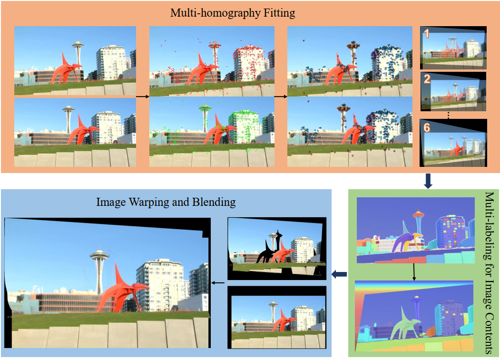

## Parallax-tolerant Image Stitching via Segmentation-based Multi-homography Warping

<center>Tianli Liao<sup>1</sup>, Ce Wang<sup>2</sup>, Lei Li<sup>1</sup>, Guangen Liu<sup>1</sup>, Nan Li<sup>3*</sup></center>

<center><sup>1</sup>Henan University of Technology, <sup>2</sup>Sun Yat-sen University, <sup>3</sup>Shenzhen University</center>

<br>




### Usage
---
Download the code, add images and corresponding SAM results in the folder "Imgs" in the main path and run the "main_MHW.m".

### Citation
```
@article{Liao2024Parallax,
title = {Parallax-tolerant image stitching via segmentation-guided multi-homography warping},
author = {Tianli Liao and Ce Wang and Lei Li and Guangen Liu and Nan Li},
journal = {Signal Processing},
pages = {109860},
year = {2024},
issn = {0165-1684},
doi = {https://doi.org/10.1016/j.sigpro.2024.109860},
}
```

If you have any comments, suggestions, or questions, please contact me (tianli.liao@haut.edu.cn).
